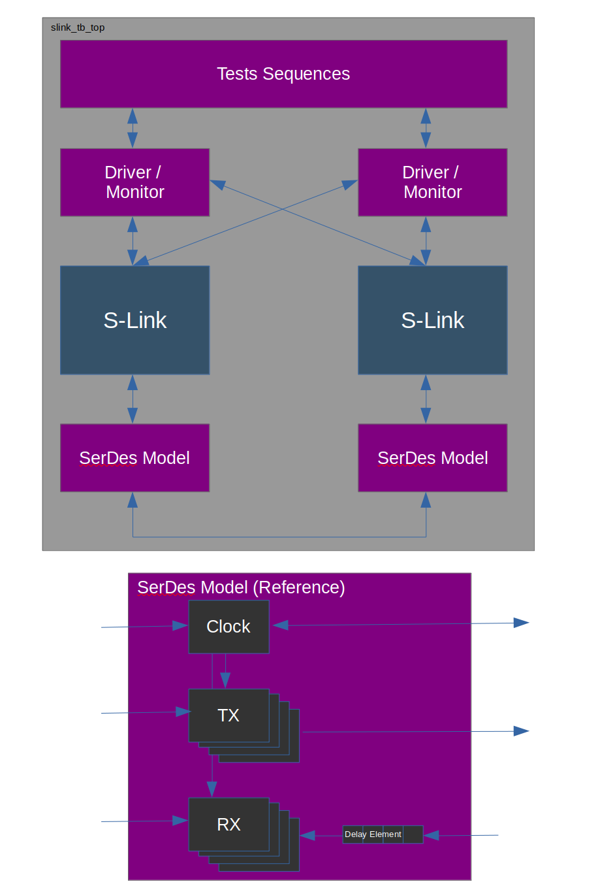

Testbench
================

The S-Link testbench allows testing of the S-Link controller with models for
the application layer, software stack, and SerDes. The testbench instantiates two S-Link
controllers, one as a Master and the other as a Slave. There are two driver/monitors and 
two SerDes models.

  
  S-Link Testbench Diagram with SerDes Block Diagram

To be compatible with iverilog, the S-Link testbench is primarily Verilog based. Any
SystemVerilog constructs that are allowed by iverilog are used where applicable. Because
of this, there isn't as much class-based and constraint randomized testing as I would 
generally like. But that's ok. iverilog is still pretty damn neat and we can test quite
a bit with a few workarounds.

.. note ::

  If the project can obtain a license from Cadence/Mentor/Synopsys for thier simulators that
  support UVM, a UVM testenv will be created.
  
  I also looked into cocotb. Cocotb was really nice but I had a hard time figuring out
  how to deal with bitslicing which was really necessary for the way the application interface
  was designed. Supposedly cocotb 2.0 is to address these issues. I will keep an eye on this
  and cocotb would be a reasonable alternative to UVM if those issues are worked out. Or if
  you have a good way to deal with bitslicing in cocotb, please let me know.

simulate.sh
-----------
``simulate.sh`` is the main simulation script. It will compile the appropriate files using iverilog then run
them with vvp. There are several flags to use for running.

* ``-t <testname>`` - Selects which test to run. If not given, ``sanity_test`` is ran
* ``-c <args>`` - Compile time arguments
* ``-p <args>`` - Plusargs to send during simulation
* ``-l <logname)`` - Name of log to print. Defaults to ``vvp.log``
* ``-r`` - Regression flag. Not to be used during interactive sessions

Waveforms are being saved in .lx2 format. (they were in .vcd, however the hierarchy in gtkwave had some issues and debugging
was a pain. So it was changed to .lx2 and that seems to work better, although it's a little bit slower when running). 
The gtkwave read file ``waveform_signals.gtkw`` can be used to bring up a few signals. LX2 filename is the standard ``dump.lx2`` iverilog uses.

Testbench Defines
-----------------
In order to test various configurations of S-Link, the ``simulate.sh`` script allows a user to
pass in some defines. Defines that can be set are listed below:

================================= ================================= ==================================================================
Define Name                       Acceptable Values                 Description
================================= ================================= ==================================================================
MAX_TX_LANES                      1/2/4                             Number of Master TX lanes and Slave RX lanes
MAX_RX_LANES                      1/2/4                             Number of Master RX lanes and Slave TX lanes
MST_PHY_DATA_WIDTH                8/16                              Phy interface width for Master
SLV_PHY_DATA_WIDTH                8/16                              Phy interface width for Slave
MST_TX_APP_DATA_WIDTH             (See doc for definition)          Application data width for Master TX
MST_RX_APP_DATA_WIDTH             (See doc for definition)          Application data width for Master RX
SLV_TX_APP_DATA_WIDTH             (See doc for definition)          Application data width for Slave TX
SLV_RX_APP_DATA_WIDTH             (See doc for definition)          Application data width for Slave RX
================================= ================================= ==================================================================

This would be an example of running the link_width_change test and indicating you want 4 lanes in each direction with a 64 bit
application data width for the TX and RX and a SEED value of 1234

::

  ./simulate.sh -t link_width_change -c "-DMAX_TX_LANES=4 -DMAX_RX_LANES=4 -DMST_TX_APP_DATA_WIDTH=64 \
    -DMST_RX_APP_DATA_WIDTH=64 -DSLV_TX_APP_DATA_WIDTH=64 -DSLV_RX_APP_DATA_WIDTH=64" -p "+SEED=1234"

SerDes Model
------------
The SerDes Model is a *very* generic SerDes that has 3 main subblocks:

* Clock - Drives or receives the bit clock based on ``IS_MASTER`` parameter
* TX - Creates the serial data from S-Link
* RX - Receives serial data from S-Link, and performs byte alignment.

Inside the RX there is also a ``delay_element`` which is used to skew the incomming RX data to exercise the deskew FIFO 
inside the S-Link controller.

This model is intended as a reference for SerDes that wish to operate with S-Link. The model handles the number of TX/RX pairs based
on the testbench configuration.

.. todo ::

  - Make the bitclk freq programmable.
  - Allow plusarg for RX deskew
  - Add 32 bit data width once controller supports.
  

.. include:: slink_app_driver.inc
.. include:: slink_app_monitor.inc
.. include:: slink_tests.inc

Regressions
-----------
Due to the various configurations of S-Link, there are many different simulations that need to be ran to exercise all
of the different possibilities. There is a small regression infrastructure set up where ``run_regression.py`` creates
tests based on different compile arguments listed above (number of lanes, phy/app data width, etc.). `Slurm <https://slurm.schedmd.com/documentation.html>`__
is used to assist with running mulitple jobs in parallel.

Currently with 1/2/4 lane, 8/16 phy data width support and testing with an application data width factor of 1x/2x/4x, there are 242 combinations for
S-Link! If you run just 5 different test for each combindation you have 1200+ tests! Due to this, regressions are really meant for checking
new changes and most users of S-Link shouldn't have to run them.

  
.. generated using get_rst.py by steven at September/01/2020  07:47:35

